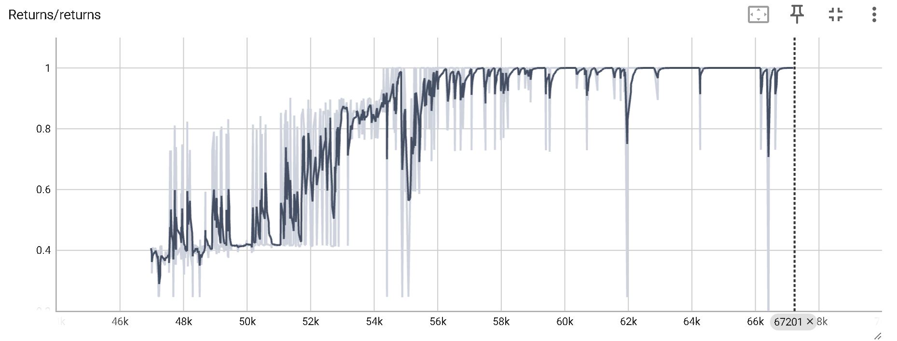
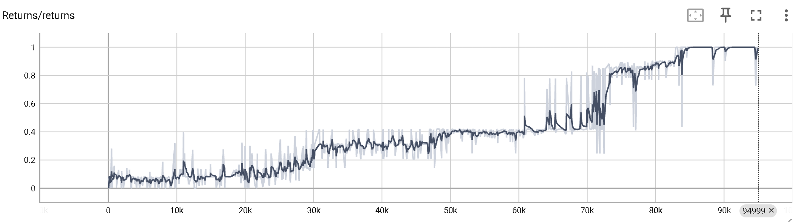
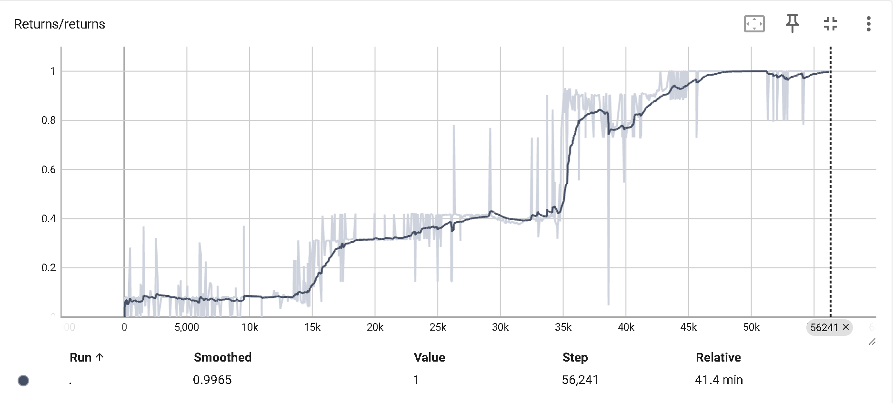
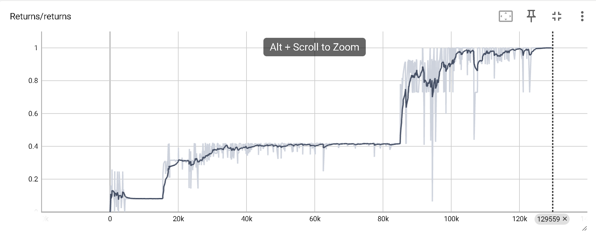
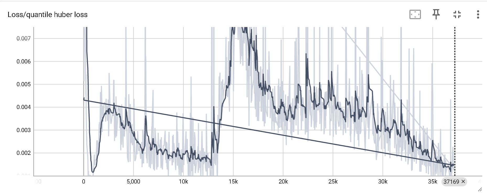

#  Multi-Pass Deep Q-Networks

This repository includes a potential DRL algorithm solution for parameterised action space MDPs:

1. P-DQN [[Xiong et al. 2018]](https://arxiv.org/abs/1810.06394)

    - MP-DQN [[Bester et al. 2019]](https://arxiv.org/abs/1905.04388)
    - SP-DQN [[Bester et al. 2019]](https://arxiv.org/abs/1905.04388)
   

Multi-Pass Deep Q-Networks (MP-DQN) fixes the over-paramaterisation problem of P-DQN by splitting the action-parameter inputs to the Q-network using several passes (in a parallel batch). Split Deep Q-Networks (SP-DQN) is a much slower solution which uses multiple Q-networks with/without shared feature-extraction layers. A weighted-indexed action-parameter loss function is also provided for P-DQN.

## Novel Improvements from Honghu
This repository is based on the following implementation: https://github.com/cycraig/MP-DQN/tree/master

In additional to the original implementation, further improvements are integrated:

(1) Double Learning for the Q-critic. [[Hasselt et al. 2015]](https://arxiv.org/abs/1509.06461)

(2) Implicit Quantile Network (IQN) to replace the Q-network with a distribution on Q estimates with a set of quantiles. [[Dabney et al. 2019]](https://arxiv.org/abs/1806.06923)

(3) Twin-Delayed DDPG (TD3) to replace hthe original module of DDPG-actor, where target policy smoothing and delayed policy updates are implemented. For Double learning, I refer to a minimalistic implementation of DDQN instead of really using 2 running and target networks. [[Fujimoto et al. 2018]](https://arxiv.org/pdf/1802.09477.pdf)

(4) Noisy Network for Exploration (Additionally decouples the noise scaling for training and acting. The training procedure features a linear decay schedule for noise, so that the training can be accelerated. However it doesn't degrade the exploration as the noise for acting still assumes the original/undecayed noise. Note the noisy network module replaces the original exploration schedule of decaying epsilon-greedy algorithm and ornstein noise applied to DDPG actor) [[Fortunato et al. 2017]](https://arxiv.org/abs/1706.10295)

(5) Prioritized Experience Replay (both with IS-ratio integration and without IS-ratio integration). [[Schaul et al. 2015]](https://arxiv.org/abs/1511.05952)


These improvements are in orthogonal directions and can be activated in a combinatorial manner.

## Dependencies

- Python 3.5+ (tested with 3.5 & 3.6 & 3.12)
- pytorch 2.2.0 (1.0+ should work but will be slower)
- gym 0.10.5
- numpy
- click
- tensorboard

<!---## Domains

The simplest installation method for the above OpenAI Gym environments is as follows:
```bash
pip install -e git+https://github.com/cycraig/gym-platform#egg=gym_platform
```

If something goes wrong, follow the installation instructions given by the repositories above. Note that gym-soccer has been updated for a later gym version and the reward function changed to reflect the one used in the code by Hausknecht & Stone [2016] (https://github.com/mhauskn/dqn-hfo). So use the one linked above rather than the OpenAI repository.-->

## Example Usage

It is recommeded to directly run run_platform_pdqn.py in your IDE in this implementation, since the click flags are configured to make it easier to run experiments and hyper-parameter searches in batches, which is better for scripts but makes it more annoying to type out.
<!---
To run vanilla P-DQN on the Platform domain with default flags:
```bash
python run_platform_pdqn.py 
```

SP-DQN on the Platform domain, rendering each episode:
```bash
python run_platform_pdqn.py--split True --visualise True --render-freq 1
```

MP-DQN on the Platform domain with four hidden layers (note no spaces) and the weighted-indexed loss function:
```bash
python run_platform_pdqn.py  --multipass True --layers [1024,512,256,128] --weighted True --indexed True
```
-->

The training stage is specified by the number of training episodes. After the training is completed, evaluation is performed by running 3000 episodes in the default configuration.


## Performance Curve

Maximual episodic return = 1

- Training Statistics (Seed 5 , IQN + DDQN + TD3 + PER + Noisy Net)



- Training Statistics (Seed 4 , IQN + DDQN + TD3 + PER + Noisy Net)



- Training Statistics (Seed 3 , IQN + DDQN + TD3 + PER + Noisy Net)



- Training Statistics (Seed 2 , IQN + DDQN + TD3 + PER + Noisy Net)




## Loss Function Monitoring

Monitor the loss function to avoid divergence

- An example of quantile loss (IQN + DDQN + TD3 + PER + Noisy Net)

 


