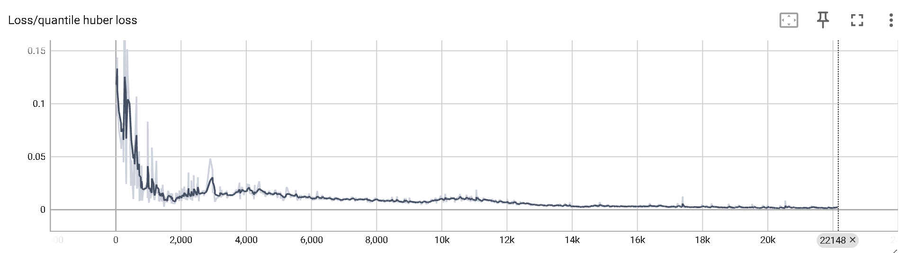

#  Multi-Pass Deep Q-Networks

This repository includes a state-of-the-art DRL algorithm solution (MP-DQN)[[Bester et al. 2019]](https://arxiv.org/abs/1905.04388) for parameterised action space MDPs (PAMDP). Parameterised action spaces consist of a set of discrete actions $`\mathcal{A}_d \equiv[K]=\left\{k_1, k_2, \ldots, \left.k_K\right\}\right.`$, where each $`k`$ has a corresponding continuous action-parameter $`x_k \in \mathcal{X}_k \subseteq \mathbb{R}^{m_k}`$ with dimensionality $`m_{k}`$.

There are multiple PAMDP RL algorithms PA-DDPG[[1]](#references), Q-PAMDP[[2]](#references), P-DQN[[3]](#references), and one state-of-the-art RL algorithm is Multi-Pass Deep Q-Networks (MP-DQN)[[Bester et al. 2019]](https://arxiv.org/pdf/1905.04388.pdf). This repository is based on the  orignal MP-DQN implementation: https://github.com/cycraig/MP-DQN/tree/master, and includes several new features as potential performance enhancement. The model of MP-DQN is illustrated below:

<p align="center">
  
</p>

The key equation of MP-DQN:
```math
Q\left(s, k, x_k\right)=\underset{r, s^{\prime}}{\mathbb{E}}\left[r+\gamma \max _{k^{\prime}} \sup _{x_{k^{\prime}} \in \mathcal{X}_{k^{\prime}}} Q\left(s^{\prime}, k^{\prime}, x_{k^{\prime}}\right) \mid s, k, x_k\right].
```

To avoid the computationally intractable calculation of the supremum over $`\mathcal{X}_{k}`$, it is suggested using a determinitic actor $`x_k\left(s ; \theta_x\right): S \rightarrow \mathcal{X}_k,`$ to appoximate $`\text{argsup}_{x_k \in \mathcal{X}_k} Q\left(s, k, x_k\right)`$, when the Q function is fixed. This converts the original equation to 
```math
Q\left(s, k, x_k\right)=\underset{r, s^{\prime}}{\mathbb{E}}\left[r+\gamma \max _{k^{\prime}} Q\left(s^{\prime}, k^{\prime}, x_{k^{\prime}}^Q\left(s^{\prime}\right)\right) \mid s, k, x_k\right]
```

The Q-network will be updated similarly to DQN [[Mnih et al. 2015]](https://www.nature.com/articles/nature14236), and the actor will updated analogously to DDPG [[Lillicrap et al. 2016]](https://arxiv.org/pdf/1509.02971.pdf).

## Additional Features from Honghu


In additional to the original implementation, further improvements are integrated: **These improvements are in orthogonal directions and can be activated in a combinatorial manner.**

### (1) Double Learning for the Q-critic (DDQN). [[Hasselt et al. 2015]](https://arxiv.org/abs/1509.06461)
DDQN is introduced to cancel maximization bias. The key equation for TD-target $`y`$ goes as:
```math
    y = r + \gamma (1 - d) Q_{\phi'}(s', \text{argmax}_{a'}Q_{\phi}(s',a')),
```
where $`\phi`$ and $`\phi'`$ denote the parameters of running network and target network respectively.

### (2) Twin-Delayed DDPG (TD3) to replace the original module of DDPG-actor, where target policy smoothing and delayed policy updates are implemented. [[Fujimoto et al. 2018]](https://arxiv.org/pdf/1802.09477.pdf)

**target policy smoothing**: Actions used to form the Q-learning target are based on the target policy, $`\mu_{\theta_{\text{targ}}}`$, but with clipped noise added on each dimension of the action. After adding the clipped noise, the target action is then clipped to lie in the valid action range (all valid actions, $`a`$, satisfy $`a_{Low} \leq a \leq a_{High})`$. The target actions are thus: 

```math
    a'(s') = \text{clip}\left(\mu_{\theta_{\text{targ}}}(s') + \text{clip}(\epsilon,-c,c), a_{Low}, a_{High}\right), \;\;\;\;\; \epsilon \sim \mathcal{N}(0, \sigma)
```

**clipped double Q-learning**:
In the original implementation, the key equation for TD-target $`y`$ goes as:
```math
    y = r + \gamma (1 - d) \min_{i=1,2} Q_{\phi_{i, \text{targ}}}(s', a'(s')),
```
However, I refer to a minimalistic implementation of DDQN instead of really using two running and target networks, as MP-DQN finally learns the Q-value in discrete action space. And the equation is as follows:
```math
    y = r + \gamma (1 - d) Q_{\phi'}(s', \text{argmax}_{a'}Q_{\phi}(s', \mu_{\theta}(s'))),
```
where $`\mu_{\theta}'`$ stands for the running actor network and $`a' = \mu_{\theta}(s')`$ represents the discrete action that maximizes the Q-value of $`s'`$ in the running Q-network. This shares the same idea of DDQN.
<!--- Alternaitvely, one could do the following:
```math
    y = r + \gamma (1 - d) \min (Q_{\phi}(s', \mu_{\theta'}(s')),  Q_{\phi'}(s', \mu_{\theta'}(s')) ) ,
```
-->

### (3) Implicit Quantile Network (IQN) to replace the Q-network with a distribution on Q estimates with a set of quantiles. [[Dabney et al. 2019]](https://arxiv.org/abs/1806.06923)
IQN learns the quantile values $`Z_{i}`$ at randomly selected quantile fractions $`\tau_{i}`$. It uses a Heavesided functions (staircase shaped functions) to approximate arbitrary inverse cumulative density function. , coupled with the corresponding quantile loss. The IQN model consists of a state(-action) embedding network $`\psi`$, cosine embedding network $`\phi`$ and quantile network $`f`$, which is shown as follows:

<div align="center">
  
  
  
</div>

### (4) Noisy Network for Exploration <!---(Additionally decouples the noise scaling for training and acting. The training procedure features a linear decay schedule for noise, so that the training can be accelerated. However it doesn't degrade the exploration as the noise for acting still assumes the original/undecayed noise. Note the noisy network module replaces the original exploration schedule of decaying epsilon-greedy algorithm and ornstein noise applied to DDPG actor)--> [[Fortunato et al. 2017]](https://arxiv.org/abs/1706.10295)
The noisy network replaces the standard linear layer with the noisy linear layer:
$`y \stackrel{\text { def }}{=}\left(\mu^w+\sigma^w \odot \varepsilon^w\right) x+\mu^b+\sigma^b \odot \varepsilon^b`$,
where $`\mu^w \in \mathbb{R}^{q \times p}, \mu^b \in \mathbb{R}^q, \sigma^w \in \mathbb{R}^{q \times p}`$ and $`\sigma^b \in \mathbb{R}^q`$ are the parameters to be learned.

In this implementation, the noisy network is applied to running & target DDPG/TD3 actor and running & target Q-network. In the IQN mode, noisy network is applied to running & target DDPG/TD3 actor, running & target quantile network, running & target state-action embedding network, but excluding the cosine network. Theoretically, cosine network could also use noisy network. The hyperparameters are set exactly as the original paper suggested.


### (5) Proportion-based Prioritized Experience Replay [[Schaul et al. 2015]](https://arxiv.org/abs/1511.05952)
The idea of PER is to prioritized sampling the experiences featuring large TD-loss, resulting in a new proposal distribution. Importance-sampling ratio is then included for each sample to make each sample is still sampled as if from a uniform distribution, i.e., target distribution. For a detailed understanding, please refer to https://danieltakeshi.github.io/2019/07/14/per/ .
In this implementation, the replay buffer size must be of the size $`2^n`$ (due to sum-tree structure), as the semi-roulette-wheel sampling strategy is applied to reduce the sampling variance, which is exactly suggested in the original work. 

The IS-ratio $`w`$ in the original work goes as:
```math
    w_{i} = \left( \frac{1}{N} \cdot \frac{1}{P(i)} \right)^{\beta},
```
where $`N`$ refers to the current experience replay size, and $`P(i)`$ represents the probability of sampling data point $`i`$ according to priorities. For stability, the $`w_{i}`$ is furthere divided by $`w_{max}`$ as a normalization factor to make sure IS-ratio is less than or equal to $`1`$ and $`w_{max}`$ refers to the maiximal IS-ratio value among all the stored experience. 

However, I found IS-ratio could result in a slow learning and osciallation in Q-value estimates due to the boostrapped update. Therefore, I set IS-ratio for each samples to just be $`1`$, i.e., without "IS-ratio integration".


## Dependencies

- Python 3.5+ (tested with 3.5 & 3.6 & 3.12)
- pytorch 2.2.0 (1.0+ should work but will be slower)
- gym 0.10.5
- numpy 1.26.4
- click 8.1.7 
- tensorboard 2.16.2

The code is successfully tested in win11.
<!---## Domains

The simplest installation method for the above OpenAI Gym environments is as follows:
```bash
pip install -e git+https://github.com/cycraig/gym-platform#egg=gym_platform
```

If something goes wrong, follow the installation instructions given by the repositories above. Note that gym-soccer has been updated for a later gym version and the reward function changed to reflect the one used in the code by Hausknecht & Stone [2016] (https://github.com/mhauskn/dqn-hfo). So use the one linked above rather than the OpenAI repository.-->

## Example Usage

**Learning from scratch**

It is recommeded to directly run *run_platform_pdqn.py* in your IDE in this implementation, since the click flags are configured to make it easier to run experiments and hyper-parameter searches in batches, which is better for scripts but makes it more annoying to type out.

**Load a trained Model**

please set the following parameters in the **click options** in *run_platform_pdqn.py*
```bash
"evaluation_mode = True", "seed = 5" and "load_model_idx = 60000"
```

<!---
To run vanilla P-DQN on the Platform domain with default flags:
```bash
python run_platform_pdqn.py 
```

SP-DQN on the Platform domain, rendering each episode:
```bash
python run_platform_pdqn.py--split True --visualise True --render-freq 1
```

MP-DQN on the Platform domain with four hidden layers (note no spaces) and the weighted-indexed loss function:
```bash
python run_platform_pdqn.py  --multipass True --layers [1024,512,256,128] --weighted True --indexed True
```
-->

The training stage is specified by the number of training episodes. After the training is completed, evaluation is performed by running 3000 episodes in the default configuration.


## Performance Curve

Maximual episodic return = 1

- Training Statistics (Seed 5 , IQN + DDQN + TD3 + PER + Noisy Net)


- Training Statistics (Seed 4 , IQN + DDQN + TD3 + PER + Noisy Net)


- Training Statistics (Seed 3 , IQN + DDQN + TD3 + PER + Noisy Net)


- Training Statistics (Seed 2 , IQN + DDQN + TD3 + PER + Noisy Net)


## Loss Function Monitoring

Monitor the loss function to avoid divergence

- quantile loss (IQN + DDQN + TD3 + PER + Noisy Net), showing convergence properties.

 

- Q-loss for the actor update (IQN + DDQN + TD3 + PER + Noisy Net), exhibiting convergence.

 

- estimated Q-value that is maximized from the sampled batch during the training episode

 

The evolution of the estimated Q-values are reasonable as the episodic return lies between 0 and 1. When consiering the the discount factor = 0.99, the estimated Q-value should be within this range.

## Evaluation Animation
The trained agent is evalauted over $`1000`$ episodes, the final episodic return is $`1.0 \pm 0.0`$. 

Trained policy after 20K episodes of training


Trained policy after ~2M frames a.k.a 60K episodes of training


References
----------

[1] [PA-DDPG](https://arxiv.org/abs/1511.04143.pdf)  
[2] [Q-PAMDP](https://arxiv.org/abs/1509.01644.pdf)  
[3] [P-DQN](https://arxiv.org/abs/1810.06394.pdf)   
[4] [DQN](https://www.nature.com/articles/nature14236)  
[5] [DDQN](https://arxiv.org/abs/1509.06461.pdf)  
[6] [DDPG](https://arxiv.org/abs/1706.10295.pdf)  
[7] [TD3](https://arxiv.org/pdf/1802.09477.pdf)  
[8] [PER](https://arxiv.org/abs/1511.05952.pdf)  
[9] [IQN](https://arxiv.org/abs/1806.06923.pdf)  
[10] [Noisy network for exploration](https://arxiv.org/abs/1706.10295.pdf)  


